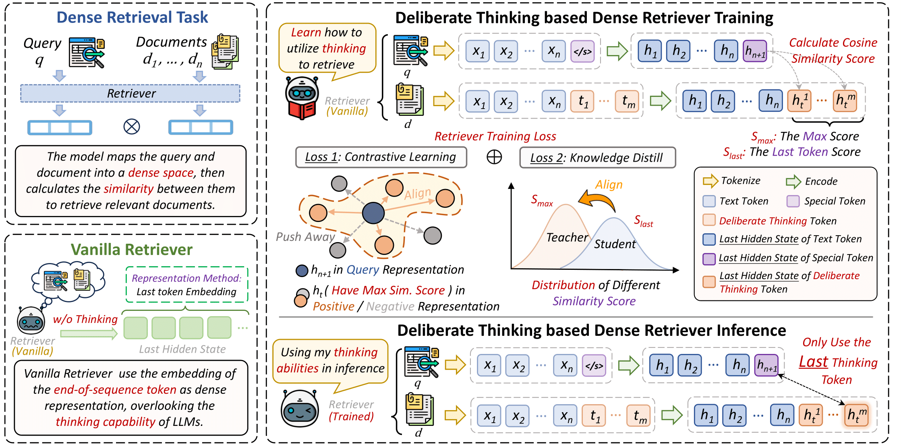

# *Learning More Effective Representations for Dense Retrieval through Deliberate Thinking Before Search* 

[](https://arxiv.org/abs/2502.12974)  [](https://huggingface.co/bigtailwolf/DEBATER-2B)  [](https://huggingface.co/bigtailwolf/DEBATER-4B)

DEBATER is a novel framework that introduces the Chain-of-Deliberation mechanism to iteratively optimize document representations through a continuous chain of thought. To consolidate information from multiple thinking steps, DEBATER incorporates the Self-Distillation mechanism, which identifies the most informative steps and integrates them into a unified text embedding.



## Installation
```bash
pip install -r requirements.txt
pip install flash-attn --no-build-isolation
```
## Training 
We use the dataset from [Repetition Improves Language Model Embeddings](https://arxiv.org/abs/2402.15449). The dataset can be downloaded from their  [GitHub](https://github.com/jakespringer/echo-embeddings#training). After downloading, put it in the data folder：


```
data
└── echo-data
    ├── allnli.jsonl
    ├── dureader.jsonl
    ...
```
To train the MiniCPM model, you can run the following script:

```bash
torchrun --nproc_per_node=4 scripts/run_supervised.py train_configs/Minicpm2-2B.json
```
or:
```bash
torchrun --nproc_per_node=4 scripts/run_supervised.py train_configs/Minicpm3-4B.json
```


Please modify the contents of the `train_configs` folder，For example：

```json
{
    "model_name_or_path": "xxxx", 
    "peft_model_name_or_path": null,
    "pooling_mode": "last_token",
    "dataset_name": "E5",
    "dataset_file_path": "xxxx/data/echo-data",
    "remove_unused_columns": false,
    "learning_rate": 2e-4,
    "num_train_epochs": 1,
    "warmup_steps": 300,
    "per_device_train_batch_size": 64,
    "per_device_eval_batch_size": 64,
    "gradient_accumulation_steps": 1,
    "do_train": true,
    "disable_tqdm": false,
    "max_seq_length": 512,
    "overwrite_output_dir": true,
    "output_dir": "xxxxxx", 
    "logging_steps": 50,
    "save_steps": 200,
    "save_only_model": true,
    "stop_after_n_steps": 1000,
    "lora_r": 16,
    "gradient_checkpointing": true,
    "torch_dtype": "bfloat16",
    "attn_implementation": "flash_attention_2",
    "seed": 42
}
```
The main modified parameters are:
```bash
"model_name_or_path": "xxxx", #The path of MiniCPM model
"dataset_file_path": "xxxx", #The path of Traing Data
"output_dir": "xxxx" #The path of Output Dir
```


## Evaluation

In order to use the trained model for evaluation, you need to modify the following content in the mteb package, the path is: `your_env_site-packages/mteb/models/llm2vec_models.py`, and customize the trained model at the end:
```bash
llm2vec_MiniCPM2B = ModelMeta(
    loader=_loader(
        LLM2VecWrapper,
        base_model_name_or_path="xxxxx", # Base MiniCPM Model
        peft_model_name_or_path="xxxxx", # Trained lora parameters
        device_map="auto",
        torch_dtype=torch.bfloat16,
    ),
    name="xxxxxx",  # Custom Name
    languages=["eng_Latn"],
    open_source=True,
    revision=None,
    release_date="2025-01-02",
)
```
We provide a sample file `llm2vec_models.py` for reference.
Run the following script to evaluate, taking Arguana as an example:

```bash
python mteb_eval.py
```
The checkpoint can be obtained at the following address:

(1) The checkpoint of the DEBATER-2B  is [here](https://huggingface.co/bigtailwolf/DEBATER-2B).

(2) The checkpoint of the DEBATER-4B is [here](https://huggingface.co/bigtailwolf/DEBATER-4B).


## Citation

If you find our work to be of value and helpful to your research, please acknowledge our contributions by citing us in your publications or projects:
```bibtex
@misc{ji2025learningeffectiverepresentationsdense,
      title={Learning More Effective Representations for Dense Retrieval through Deliberate Thinking Before Search}, 
      author={Yifan Ji and Zhipeng Xu and Zhenghao Liu and Yukun Yan and Shi Yu and Yishan Li and Zhiyuan Liu and Yu Gu and Ge Yu and Maosong Sun},
      year={2025},
      eprint={2502.12974},
      archivePrefix={arXiv},
      primaryClass={cs.IR},
      url={https://arxiv.org/abs/2502.12974}, 
}
```
## Contact
If you have questions, suggestions, and bug reports, please email:
```bash
bigtailwolf001@gmail.com
```
